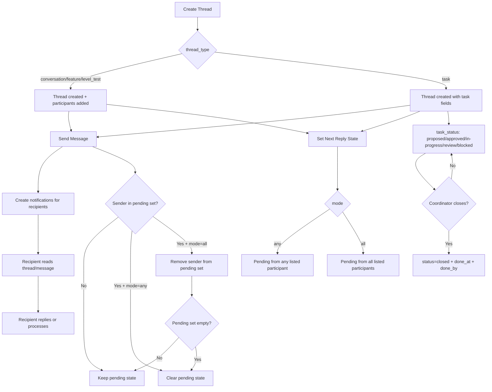

# Spec: Thread Reply Pending State

## Context
Sumesh requested a way to indicate in a thread **who should reply next** (one or many participants), with state persisted in DB.

Feedback from Mithran in thread `131e2453-3b9a-4a55-ad76-ee9a3bb99e8f`:
- Current DM label causes confusion when behavior is same as normal conversation.
- Suggested introducing explicit reply-pending state via a related table.
- Requirement supports one or multiple expected repliers.

## Goal
Add first-class, queryable reply-pending state so coordinator/UI can show:
- `Reply pending: <participant>`
- `Reply pending: <participant A, participant B>`
- `Reply pending: Any of <N participants>`

## Non-goals
- Full escalation/reminder automation in v1.
- Complex workflow engine.
- Replacing thread reply policy (`thread_reply_policy`) logic.

---

## Data Model

### Option chosen: Related table (not inline columns in `threads`)

```sql
CREATE TABLE thread_next_reply (
  thread_id UUID PRIMARY KEY REFERENCES threads(thread_id) ON DELETE CASCADE,
  mode TEXT NOT NULL DEFAULT 'any' CHECK (mode IN ('any', 'all')),
  pending_participant_ids UUID[] NOT NULL DEFAULT '{}',
  reason TEXT NULL,
  set_by UUID NULL,
  set_at TIMESTAMPTZ NOT NULL DEFAULT now(),
  expires_at TIMESTAMPTZ NULL,
  cleared_at TIMESTAMPTZ NULL
);
```

### Why this shape
- Supports multiple pending actors naturally.
- Keeps `threads` table clean.
- Allows future history/audit extension.

### Optional denormalized helper on `threads`
For list performance/filtering:

```sql
ALTER TABLE threads
  ADD COLUMN has_reply_pending BOOLEAN NOT NULL DEFAULT false;
```

Keep this in sync from route logic (or trigger).

---

## API Contract

### 1) Set / update pending state
`PATCH /api/v1/threads/:thread_id/next-reply`

Request:
```json
{
  "mode": "any",
  "pending_participant_ids": ["uuid-1", "uuid-2"],
  "reason": "Need approval",
  "expires_at": "2026-03-14T00:00:00Z"
}
```

Rules:
- `pending_participant_ids` must all be active participants in thread.
- `mode`:
  - `any`: first pending participant reply clears state.
  - `all`: each pending participant must reply; clear when set exhausted.
- Empty `pending_participant_ids` => clear state.

### 2) Clear pending state
`DELETE /api/v1/threads/:thread_id/next-reply`

Marks cleared (`cleared_at=now`) and sets `has_reply_pending=false`.

### 3) Read with thread APIs
Extend existing:
- `GET /api/v1/threads`
- `GET /api/v1/threads/:thread_id`

Response include:
```json
"next_reply": {
  "mode": "any",
  "pending_participant_ids": ["uuid-1"],
  "pending_participant_slugs": ["MITHRAN"],
  "reason": "Need confirmation",
  "set_at": "...",
  "expires_at": "...",
  "cleared_at": null
}
```

---

## Auto-resolution Behavior
When `POST /threads/:thread_id/messages` is called:
1. Load active `thread_next_reply` row (`cleared_at IS NULL`).
2. If sender is in pending set:
   - mode=`any`: clear entire next-reply state.
   - mode=`all`: remove sender from pending set; clear when empty.
3. Update `threads.has_reply_pending` accordingly.

---

## Permissions
- Set/clear next reply: thread creator, project owner, coordinator.
- Read next reply: any active participant.

---

## UI
Thread list + detail:
- Badge examples:
  - `Reply pending: Mithran`
  - `Reply pending: Mithran, Sanjaya`
  - `Reply pending: Any of 3`
- Expiry indicator when `expires_at` passed (warning style).

---

## Migration Plan
1. Migration: create `thread_next_reply` + index on `(cleared_at, expires_at)`.
2. (Optional) migration: add `threads.has_reply_pending` boolean.
3. API: add patch/delete handlers + read model join.
4. Message-send route: auto-resolution hook.
5. UI: badge rendering in thread list/detail.

---

## Open Questions
1. Should we store history of changes (event log table) in v1 or v2?
2. Should `set_by` distinguish user vs agent explicitly (`set_by_type`)?
3. For `all` mode, do we need per-user fulfilled timestamps in v1?

---

## Acceptance Criteria
- Can set one or many pending repliers on a thread.
- Thread APIs return pending-reply state.
- Incoming message from pending participant auto-updates/clears state as per mode.
- UI visibly indicates pending reply actors.
- No regression in existing thread/task flows.

---

## React Flow Data Contract

### Node types and fields

| Node type | Required fields | Notes |
| --- | --- | --- |
| `lane` | `id`, `type`, `position`, `data.label`, `data.kind='lane'` | Static state lane: `open`, `task-active`, `review`, `closed`, `archived`. |
| `state` | `id`, `type`, `position`, `data.label`, `data.state_key`, `data.status`, `data.isActive` | Main thread state node. `state_key` is one of `conversation.open`, `task.proposed`, `task.approved`, `task.in_progress`, `task.review`, `task.blocked`, `thread.closed`, `thread.archived`. |
| `next-reply` | `id`, `type`, `position`, `data.label`, `data.mode`, `data.pendingParticipantSlugs`, `data.reason`, `data.expiresAt`, `data.isExpired`, `data.isActive` | Dynamic node shown only when `next_reply` exists. |
| `participant-badge` | `id`, `type`, `position`, `data.slug`, `data.isPending`, `data.isSatisfied` | Child-style visual node for each pending participant in `all` mode or collapsed badge group in `any` mode. |

### Edge types and fields

| Edge type | Required fields | Notes |
| --- | --- | --- |
| `transition` | `id`, `source`, `target`, `type`, `data.label`, `data.event`, `data.isActivePath` | Main lifecycle edge between thread states. |
| `reply-expected` | `id`, `source`, `target`, `type`, `data.label`, `data.mode`, `data.isActivePath` | Connects current active state to the `next-reply` node. |
| `reply-participant` | `id`, `source`, `target`, `type`, `data.label`, `data.isSatisfied` | Connects `next-reply` node to each pending participant badge. |

### Sample JSON for this thread flow

```json
{
  "nodes": [
    {
      "id": "state-conversation-open",
      "type": "state",
      "position": { "x": 80, "y": 96 },
      "data": {
        "label": "Conversation Open",
        "kind": "state",
        "state_key": "conversation.open",
        "status": "open",
        "isActive": true
      }
    },
    {
      "id": "next-reply",
      "type": "next-reply",
      "position": { "x": 380, "y": 96 },
      "data": {
        "label": "Reply Pending",
        "mode": "all",
        "pendingParticipantSlugs": ["MITHRAN", "SANJAYA"],
        "reason": "Need confirmation on rollout",
        "expiresAt": "2026-03-14T00:00:00Z",
        "isExpired": false,
        "isActive": true
      }
    },
    {
      "id": "pending-MITHRAN",
      "type": "participant-badge",
      "position": { "x": 700, "y": 64 },
      "data": {
        "slug": "MITHRAN",
        "isPending": true,
        "isSatisfied": false
      }
    },
    {
      "id": "pending-SANJAYA",
      "type": "participant-badge",
      "position": { "x": 700, "y": 128 },
      "data": {
        "slug": "SANJAYA",
        "isPending": true,
        "isSatisfied": false
      }
    }
  ],
  "edges": [
    {
      "id": "edge-open-to-next-reply",
      "source": "state-conversation-open",
      "target": "next-reply",
      "type": "reply-expected",
      "data": {
        "label": "await reply",
        "mode": "all",
        "isActivePath": true
      }
    },
    {
      "id": "edge-next-reply-to-MITHRAN",
      "source": "next-reply",
      "target": "pending-MITHRAN",
      "type": "reply-participant",
      "data": {
        "label": "pending",
        "isSatisfied": false
      }
    },
    {
      "id": "edge-next-reply-to-SANJAYA",
      "source": "next-reply",
      "target": "pending-SANJAYA",
      "type": "reply-participant",
      "data": {
        "label": "pending",
        "isSatisfied": false
      }
    }
  ]
}
```

### Event to graph transition mapping

| Event | Graph change |
| --- | --- |
| `thread.created` | Create base lifecycle nodes; activate `conversation.open` or initial task state. |
| `thread.updated` with `thread_type/status/task_status` change | Recompute active lifecycle node and highlight latest `transition` edge. |
| `thread.updated` with `next_reply` payload | Create/update/remove `next-reply` node and participant badge nodes. |
| `PATCH /threads/:thread_id/next-reply` | Add `reply-expected` edge from current active state to `next-reply`; mark pending badges active. |
| `DELETE /threads/:thread_id/next-reply` | Remove `next-reply` and `reply-participant` nodes/edges; active state remains on lifecycle lane. |
| `thread.message_created` from non-pending sender | No graph state change beyond message history. |
| `thread.message_created` from pending sender, mode=`any` | Remove `next-reply` node and related edges immediately. |
| `thread.message_created` from pending sender, mode=`all` | Remove sender badge from pending set; clear `next-reply` node when set becomes empty. |
| `participant removed` while pending | Remove matching participant badge; clear `next-reply` if no pending participants remain. |

---

## Diagram Requirements (added per Sumesh request)

### Phase 1 — Spec/static diagram (Mermaid)
Embed this in docs/spec for architecture discussions:



### Phase 2 — Real-time live diagram in product UI
Implement an interactive thread-flow panel in thread detail.

#### Rendering tech
- Use **React Flow** (preferred for live state updates and interaction).

#### Data sources
- Initial load: `GET /threads/:thread_id` + `GET /threads/:thread_id/messages` + next_reply state.
- Live updates: subscribe to existing events (`thread.updated`, message events, task status changes).

#### Real-time behavior
- Recompute current graph state on each event.
- Highlight active node (current state) and latest transition edge.
- Update pending-reply labels immediately when:
  - next-reply state is set/cleared
  - pending participant sends a message (auto-resolution)

#### UI outputs
- Badges in panel + thread header:
  - `Reply pending: Mithran`
  - `Reply pending: Mithran, Sanjaya`
  - `Reply pending: Any of 3`
- Show stale/expired visual warning when `expires_at < now()`.

#### Acceptance for live diagram
- Diagram updates without page reload on thread/message changes.
- Correctly reflects `any` vs `all` resolution behavior.
- Handles task threads and non-task threads in same component.
